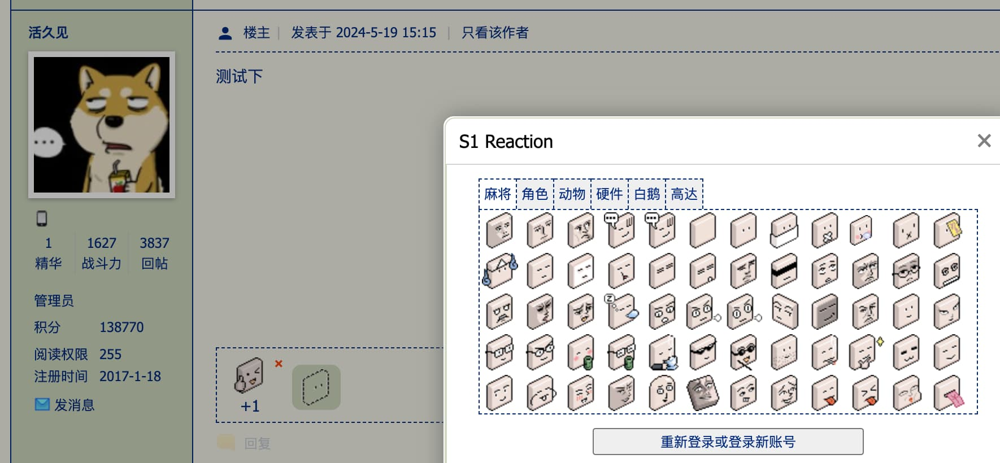

# S1 Reaction 帖子回应服务

用麻将脸回应泥潭吧！为 S1 论坛的帖子增加表情回应功能的第三方插件。

使用云端数据库保管数据而非本地保存，在有限的用量内提供 Serverless 数据后端（指用量超出服务商的免费额度就玩球了，~~充钱是不可能充的~~）。

**为保证服务用量在可接受的范围内，需要用户通过脚本登录 S1 账号验证有效后才会提供数据写入功能（具体验证规则见下方用户验证）。
服务保证不收集超出必要的用户信息，不过确实有接收账号敏感数据（Session ID）用于验证的步骤，介意的话可以不登录使用（只读）。**

- 泥潭发布帖：https://bbs.saraba1st.com/2b/thread-2184175-1-1.html
- Greasy Fork 用户脚本发布地址：
  - 在线版：https://greasyfork.org/scripts/494721
  - 离线版：https://greasyfork.org/scripts/495710

## 功能特性

- 用麻将脸表情对帖子发表回应标记，包括主楼及每一层的回帖，不限制发帖对象。
- 为防止滥用，一个账号只能对同一个帖子标记一次，重复发表会更新原来的内容。
- 回应栏会出现在回复按钮的上方，帖子评分及个人签名的下方。
- 点击回应栏的绿底小透明麻将脸打开账号登录管理及选择麻将脸进行回应的弹窗，直接点击表情即可发出回应。
- 点击已经存在回应的右上方绿色加号可以快速复读 +1。
- 如果是该登录账号已经作出的回应，则会对应出现一个红叉代表移除。
- 支持多账号登录和切换管理，同一账号重复登录只会保留最新的 Token，切换账号后建议刷新页面重新查询该账号是否对帖子作出过回应。
- 用户 Token 因为在签发后无法被主动销毁，所以支持在登录时设置一个有效期。
- 用户对帖子作出的回应在前台对他人匿名，后台为了保证一个用户只能对一个帖子回应一次，所以保存了 ID 关联。
- 用户的个人资料页会展示该用户送出及收到的所有回应统计（在考虑要不要保留这个功能）。
- 服务后端通过 OpenAPI 规范开放服务接口定义，欢迎移动端 App 接入服务（如果有的话）。

## 用户验证

该服务的查询接口对所有人开放，无需登录账号使用，不过要想写入数据则需要你登录有效的 S1 账号以生成授权 Token。

这个 Token 和 S1 官方服务无关，仅用于保证经该服务验证过的用户信息不被篡改（如果你想提前了解一点技术细节，它就是一个简易版的 JWT）。

下面是验证用户生成 Token 的步骤，如果你不关心可以跳过（虽然我建议你关心一下）：

1. 本地客户端处理登录请求，通过官方登录接口获取用户的 sid（Session ID）。
    1. ⚠️注意！sid 是账号登录状态，任何人只要知道你的 sid 就可以用你的身份使用发帖等论坛功能。
    2. 该服务作为第三方，为了确保用户登录的信息真实有效，需要接收 sid（替代用户名密码）在服务端调用官方查询接口进行验证。
    3. 如果你无法信任该服务完全可以选择不登录，服务保证不会将 sid 用于验证用户信息有效性以外的用途，也不会通过日志留痕、写入到数据库之类的任何手段保存用户 sid。
        1. 所有代码开源欢迎审查，服务端部署和客户端脚本发布也通过 GitHub Action 公开了所有部署流程。
        2. 当然我拥有服务的所有权，想做坏事完全有办法绕过所有的公开流程，这就是我所能提供的全部信任度了。
        3. 后面有机会可能会完善自部署的开发指引最大程度保护用户隐私，现阶段的代码层面也已经包含了所有必要的自部署信息，只不过没有文档化。
2. 服务端拿到 sid 后，会通过 sid 调用官方查询用户历史回帖的接口，获取该用户最近一条回复来验证发帖人 uid 是否和登录信息中的 uid 相同，如果 uid 一致则验证通过。
    1. 用户的历史发帖是站内公开数据，涉及隐私的程度较轻，至少我个人还比较接受。
    2. 所以，如果登录用户是一个零回复小号，没有可以用于验证的最新回复，也就无法通过验证，哪怕 sid 是有效的。
    3. 验证历史回帖这一方案其实是找不到合适接口的权宜之计，我会在这里等待一个更好的方法来移除用户必须有一个回帖的限制。
        1. 顺便因为泥潭发帖需要绑定手机号实名的要求，这个限制其实也在变相要求账号实名了，虽然它并非设计如此。
3. 服务端验完用户信息后，会对它签名加密（不包含 sid），将加密后的字符串作为 Token 随同被签名的信息发给用户。
    1. 单向加密保证数据一经签名不会被篡改，后面就可以通过是否成功验签作为验证用户的手段，不会再请求官方接口。
    2. 验签成功的用户信息就可以被认为是有效的，所以该服务并不需要保存用户登录信息，Token 是无状态的。
4. 最后，客户端无论服务端是否成功生成 Token，都会立即调用官方登出接口注销 sid，尽快确保发出去的 sid 没有机会被再次使用。
    1. 因为 sid 的获取和注销都在客户端进行，也能保证执行的代码公开透明，避免有隐藏的后门存在。

## 服务后端接口文档

- SwaggerUI: https://s1-reaction.beepers-topaz-0c.workers.dev/
- ReDocUI: https://s1-reaction.beepers-topaz-0c.workers.dev/redocs

## Todos

- [x] 离线单用户本地版，用于无需登录使用
- [ ] 优化前端 UI
- [ ] 增加泥潭移动版视图支援
- [ ] 切换用户或登录后自动刷新当前页面的回应
- [ ] 发表回复后自动给新回复的帖子挂载回应元素
- [ ] 手动刷新麻将脸的本地 JSON 缓存
- [ ] 一键清空账号作出的所有回应数据
- [ ] 为古董浏览器构建遗产版
    - 老实说不太想弄，有需求再说
- [ ] 私有部署指引文档
- [ ] `packages/client/src/assets/smiley/carton2017` 本地构建缺少表情 431 ~ 451

## 项目感谢

- https://github.com/kawaiidora/s1emoticon
    - 感谢提供麻将脸打包用于脚本在泥潭倒闭时也可以进行离线测试。
- https://github.com/zzq889/stage1st-app
    - 感谢提供了泥潭多个官方接口的地址及用法。
- [查看S1不可见内容(审核中/禁言)自动版](https://greasyfork.org/scripts/419494)
    - 参考了官方登录接口的用法和用户登录表单。
    - 顺便这个脚本也是我刷泥潭使用次数最多的脚本，感谢作者。
- [S1 User Marker](https://greasyfork.org/scripts/439193)
    - 「想用脚本对用户进行标记」这一想法最初的来源，感谢提供灵感。
- [一个非典型公益图床项目](https://bbs.saraba1st.com/2b/thread-1902560-1-1.html)
    - 感谢流浪图床为该服务的部署方式（Cloudflare Workers）提供可行的思路。
